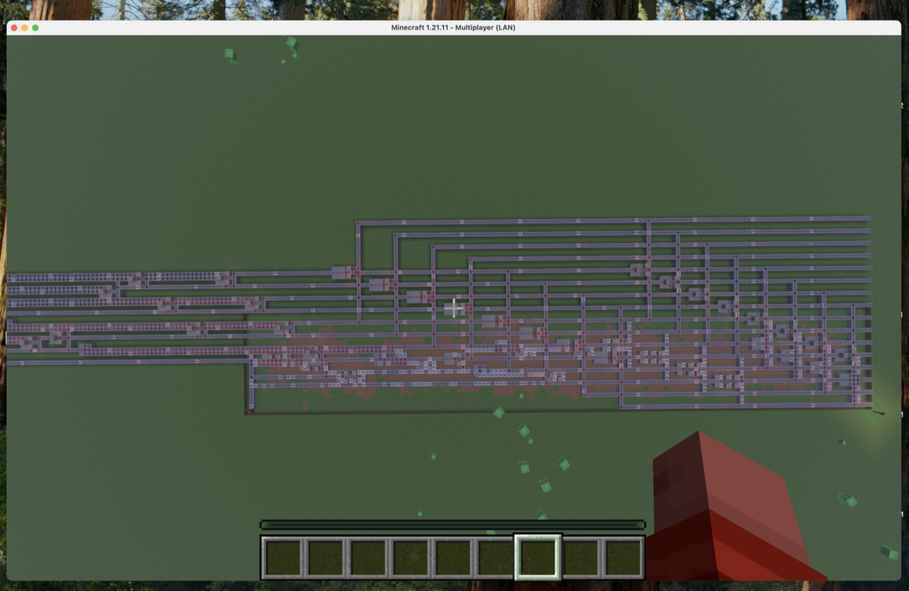

# Minecraft Circuits



**LLM-friendly redstone from logic.** Turn Verilog or a netlist into Minecraft block layouts. No game connection — design only. Built for **LLM-based runs**: your model generates Verilog or a netlist, this library turns it into buildable redstone. Works in Node, scripts, or any LLM pipeline.

**Runs out of the box.** Clone the repo — no `npm install`, no runtime dependencies. Netlist path needs nothing else; Yosys is optional (only for Verilog).

Redstone gate and routing logic was extracted from [Mindcraft](https://github.com/mindcraft-bots/mindcraft) (by [Kolby Nottingham](https://kolbynottingham.com/mindcraft) / mindcraft-bots). This package is a standalone, dependency-free version for use outside the full Mindcraft stack.

[](https://www.npmjs.com/package/minecraft-circuits)
[](https://opensource.org/licenses/MIT)

## Runs out of the box

```bash
git clone https://github.com/RyanRana/minecraft-circuts.git
cd minecraft-circuts
npm test          # no install needed — sanity check (no Yosys)
npm run example   # netlist → redstone example
```

No `npm install` in the repo. Zero runtime dependencies. Optional: [Yosys](https://yosyshq.readthedocs.io/) (e.g. `brew install yosys`) only if you use `circuitFromVerilog`.

## Install (as a dependency)

```bash
npm install minecraft-circuits
```

## Quick start

```js
import { circuitFromVerilog, netlistToRedstone } from 'minecraft-circuits';

// From Verilog (requires Yosys)
const design = await circuitFromVerilog(`
  module and_gate(input a, input b, output y);
    assign y = a & b;
  endmodule
`, 'redstone_lamp');

// From netlist (no Yosys)
const netlist = {
  inputs: [{ name: 'a', bit: 1 }, { name: 'b', bit: 2 }],
  outputs: [{ name: 'y', bit: 3 }],
  gates: [{ type: '$_AND_', inputs: [1, 2], output: 3 }],
};
const design2 = netlistToRedstone(netlist, 'redstone_lamp');

// design.blocks = [{ block: 'stone', dx, dy, dz }, ...]
// design.size = { x, y, z }
// design.inputPositions / design.outputPositions
```

## API

### Core

| Function | Description |
|----------|-------------|
| `netlistToRedstone(netlist, outputType?)` | Convert a netlist to block layout. `outputType`: `'redstone_lamp'`, `'iron_door'`, `'sticky_piston'`, `'dispenser'`, `'dropper'`. |
| `circuitFromVerilog(verilog, outputType?)` | Synthesize Verilog with Yosys and return block layout. |
| `circuitFromNetlist(netlist, outputType?)` | Run `netlistToRedstone` and `autoFixDesign`. |
| `autoFixDesign(design)` | Add missing support blocks under wire/torch and dedupe. |

### Synthesis (optional Yosys)

| Function | Description |
|----------|-------------|
| `synthesize(verilog)` | Run Yosys and return netlist. |
| `parseNetlist(text)` | Parse Yosys JSON netlist. |
| `isYosysAvailable()` | `Promise<boolean>`. |

### Validation & parsing

| Function | Description |
|----------|-------------|
| `parseJSON(text)` | Extract JSON from LLM output (handles markdown/code fences). |
| `validateCircuitDesign(design)` | Require `blocks` and (block, dx, dy, dz); fill `size` if missing. |
| `validateCircuitPlan(plan)` | Validate plan structure. |

### LLM usage (prompts)

Designed for **LLM-based runs**: feed a prompt to your model, get Verilog or JSON, then run it through this package. No extra setup.

- **`VERILOG_PROMPT`** — have the LLM generate Verilog from a natural-language description → `circuitFromVerilog(verilog)`.
- **`DESIGNER_PROMPT`** — have the LLM generate a block design from a plan → `parseJSON` + `validateCircuitDesign`.
- **`PLANNER_PROMPT`** — have the LLM produce a circuit plan.
- **`CORRECTOR_PROMPT`** — have the LLM fix invalid design JSON.

```js
import { VERILOG_PROMPT, DESIGNER_PROMPT, circuitFromVerilog, parseJSON, validateCircuitDesign } from 'minecraft-circuits';
// or: import { VERILOG_PROMPT } from 'minecraft-circuits/prompts';
```

## Output format

- **blocks**: `Array<{ block: string, dx: number, dy: number, dz: number }>` — relative positions. Block IDs match Minecraft (e.g. `redstone_wire`, `repeater[facing=east,delay=1]`, `redstone_lamp`).
- **size**: `{ x, y, z }` — bounding box size.
- **inputPositions** / **outputPositions**: offsets and labels for inputs/outputs.

## Supported gates

Yosys primitives: NOT, AND, NAND, OR, NOR, XOR, XNOR, BUF, MUX; D-latches; DFFs mapped to D-latches. Inputs named `clk`/`clock` get a repeater-loop clock with a kickstart lever.

## Requirements

- **Node.js** ≥ 18
- **Yosys** (optional) for Verilog synthesis

## Origin

Circuit design and gate-placer logic originated in [mindcraft-bots/mindcraft](https://github.com/mindcraft-bots/mindcraft). This package repackages that work as a standalone library; improvements (e.g. collision-aware routing, XOR/MUX fixes) are maintained here.

## License

MIT

## Contributing

Contributions are welcome. Open an [issue](https://github.com/RyanRana/minecraft-circuts/issues) or [pull request](https://github.com/RyanRana/minecraft-circuts).
